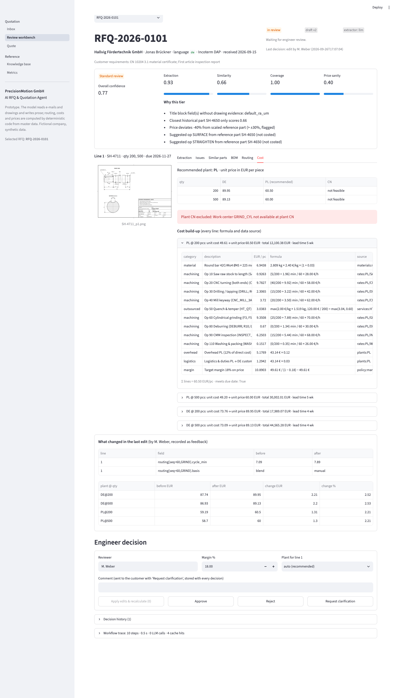
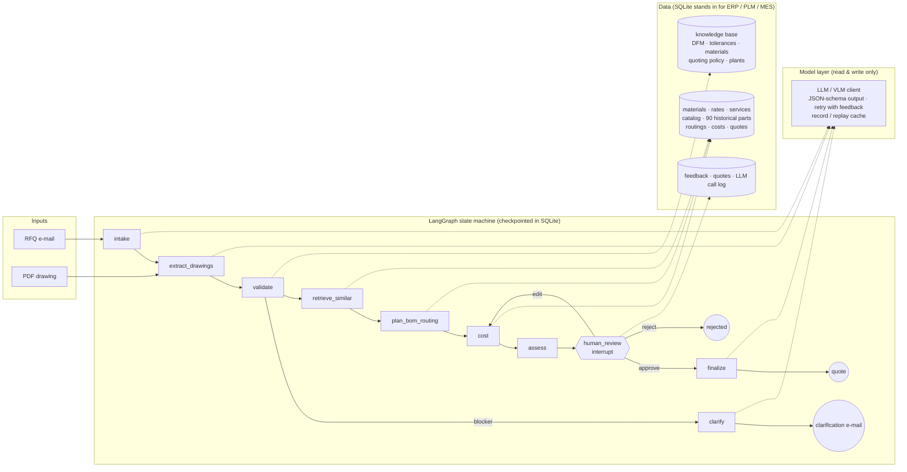

# AI RFQ & Quotation Agent — prototype

**IndustrialMind.ai Solution Design Challenge · Option B (working prototype)**
Customer scenario: *PrecisionMotion GmbH* (fictional) — gearboxes, servo motors, actuators; plants in Germany, Poland and China; 15,000 RFQs a year.

> A customer e-mail and a PDF drawing go in. A few minutes later an engineer gets a **quote draft with sources, a confidence score and a triage decision**, reviews it, edits what needs editing, and approves.
> **The model reads and writes; deterministic code calculates.** Every price line shows its formula and data source, and every engineer edit is stored as feedback.



Everything runs **locally**: a local vision-language model (Gemma 4 12B via Ollama) reads the drawings, so no drawing leaves the machine. All model outputs are **recorded**, so the full demo also runs **with no model and no API key** (replay mode).

---

## Contents

1. [Why start with RFQ → quote](#1-why-start-with-rfq--quote)
2. [What the prototype does](#2-what-the-prototype-does)
3. [Quick start](#3-quick-start)
4. [Architecture and key decisions](#4-architecture-and-key-decisions)
5. [Sample input → output](#5-sample-input--output)
6. [Evaluation](#6-evaluation)
7. [Business case](#7-business-case)
8. [Roadmap](#8-roadmap)
9. [From prototype to production](#9-from-prototype-to-production)
10. [Limitations — read before trusting a number](#10-limitations--read-before-trusting-a-number)
11. [Repository layout](#11-repository-layout)

---

## 1. Why start with RFQ → quote

Where the 150 engineers' time goes (estimates; 1,650 productive hours per engineer and year ≈ 247,500 h):

| Process | Volume / year | Engineering hours (assumption) | Hours / year | Share of capacity |
|---|---|---|---|---|
| **RFQ quotation** (read drawing, plan routing, estimate times, cost, review) | 15,000 RFQs | 4 h | **60,000 h** | **~24 %** |
| Formal drawing review / DFM after order | ~1/3 of 50,000 drawings | 0.5–1 h | ~12,000 h | ~5 % |
| Final BOM + routing for won orders (~25 % win rate) | ~3,750 new parts | 3 h | ~11,000 h | ~4.5 % |
| Engineering change requests | ~3,000 | 3 h | ~9,000 h | ~3.6 % |
| Searching documents / asking senior colleagues | 150 × 3 h / week | — | ~20,000 h | ~8 % |

Quotation is the right first use case:

- **Largest effort**: about a quarter of engineering capacity.
- **Closest to revenue**: quote speed and consistency decide win rate and margin, which makes the business case easy to verify.
- **Reusable capabilities**: drawing understanding, DFM review, similar-part search, BOM and routing generation are all steps *inside* the quote. Building the quote agent builds the core of the Drawing, BOM, Process-Planning and Design-Review agents.
- **Low risk**: a human approves every quote before it leaves the company, and nothing is written back to production systems.
- **Data already exists**: historical quotes (ERP), actual times (MES) and drawings (PLM).

## 2. What the prototype does

```
e-mail (DE/EN) + PDF drawing
  → Intake        read the RFQ e-mail into a structured request            [LLM]
  → Drawing       read title block, features, tolerances, notes, parts list [VLM, region crops]
  → Review        validation + DFM rules, each citing a knowledge-base section [rules]
  → Similar parts explainable similarity against 90 historical parts, reuse hint [code]
  → BOM + routing rule-based routing (R01–R14), calibrated with the closest precedent [code]
  → Should-cost   3 plants × quantity tiers, formula + source on every line [code]
  → Triage        confidence → FAST_TRACK / STANDARD / MANUAL               [code]
  → Engineer review: approve · edit times/ops/margin/plant → recalculate → review again
  → Quote (HTML/JSON) + cover letter, or a clarification e-mail           [templates; LLM writes prose only]
```

Four sample RFQs (all companies and parts fictional) each exercise a different path:

| RFQ | Language | Part | What it shows | Result |
|---|---|---|---|---|
| RFQ-2026-0101 | German | Output shaft Ø40×220, 42CrMo4+QT, bearing seats Ø35 k6 Ra 0.8 | Tight fit → grinding added automatically; CN plant has no cylindrical grinder → excluded with reason; engineer edits a grinding time → price recalculated → edit stored as feedback | **STANDARD** |
| RFQ-2026-0102 | English | Motor flange Ø120×25, EN AW-6082, spigot Ø80 H7, anodized | Near-identical historical part (score 0.99) → reuse hint; price confirmed by precedent | **FAST_TRACK** (one-click approval) |
| RFQ-2026-0103 | English | Bracket 160×80×60, **material field empty**, 1.5 mm wall, Ø6×80 deep hole | Blocker → no price; clarification e-mail drafted from the rule findings; DFM warnings cite the knowledge base | **MANUAL** (waiting for customer) |
| RFQ-2026-0104 | German | Actuator sub-assembly, 7-line parts list | BOM agent matches catalog / internal / new parts; new end cover quoted as "price on request" | **STANDARD** |

## 3. Quick start

Requirements: Python 3.12 and [uv](https://docs.astral.sh/uv/). A model is **optional**.

```bash
make setup      # uv sync
make data       # build data/rfq.db: master data + 90 synthetic historical parts
make demo       # RFQ-2026-0102 end to end, auto-approved fast track → quote in data/runtime/quotes/
make ui         # Streamlit engineer workbench on http://localhost:8501
make test       # full test suite
make eval       # regenerate all evaluation reports in eval/reports/
```

With no model installed, the default `LLM_MODE=auto` replays the recorded model outputs in `fixtures/llm_cache/`. Cover letters and clarification e-mails fall back to built-in templates.

CLI walk-through of the human-in-the-loop path:

```bash
uv run rfq run data/samples/RFQ-2026-0101                              # stops at engineer review (STANDARD)
uv run rfq review RFQ-2026-0101 --edit-cycle 1:60:8.0 --reviewer "M. Weber"   # grinding 7.2 → 8.0 min, recalculated
uv run rfq review RFQ-2026-0101 --approve --reviewer "M. Weber"      # works across process restarts (SQLite checkpoint)
uv run rfq run data/samples/RFQ-2026-0103                              # blocker → clarification e-mail, no price
uv run rfq kb "deep hole drilling"                                     # knowledge-base search
```

Running the model live (optional):

```bash
ollama pull gemma4:12b          # ~7.6 GB, text + vision
LLM_MODE=live uv run rfq run data/samples/RFQ-2026-0101
```

The model is configurable (`.env.example`): any Ollama model, any OpenAI-compatible endpoint, or Anthropic. Changing it is one line of configuration.

## 4. Architecture and key decisions



The five decisions that matter most:

| # | Decision | Why | The question it answers |
|---|---|---|---|
| 1 | **The model reads and writes; code calculates.** Prices, times and weights come from deterministic code. The LLM writes prose only, and all numbers in letters are rendered by templates (post-checked: any currency amount in LLM text → template fallback). | A quote is a commercial commitment and has to be reproducible and auditable. LLM arithmetic is neither. | "Why use an LLM at all?" → Reading German e-mails and drawings, and writing customer letters: things rules can't do. |
| 2 | **Fixed workflow for the main path; agent autonomy only where the task is open-ended.** The quote path is a LangGraph state machine. An open-ended engineering assistant (tool calling) is designed but not built here (§9). | The quote steps are known in advance. Letting a model decide "what next" only adds variance. Open questions from engineers do need tool choice. | "Where is the agent?" → Where it pays: open-ended questions. Not in a process that must behave the same way every time. |
| 3 | **Every number is traceable.** Each cost line carries a formula with substituted values and a source (`rates:PL/CNC_TURN`, `materials:42CrMo4`, `services:HT_QT`, rule IDs, reference part). | Engineers don't trust black boxes, and audits need the trail. | See the screenshot above. |
| 4 | **Triage by confidence instead of all-auto or all-manual.** FAST_TRACK needs a high score **and** a close precedent (top similarity ≥ 0.85) **and** a price confirmed by that precedent. Any warning → STANDARD; any blocker → MANUAL. | One-click approval only where the evidence supports it; human attention goes where it is needed. | "Can you trust the score?" → Thresholds are starting values. In production they are calibrated so that engineers change < 5 % of FAST_TRACK quotes. |
| 5 | **Every engineer edit is data.** Before/after snapshots and a field-level diff are stored per review round. | This is the evaluation set, and the signal for recalibrating routing coefficients. | See [feedback report](eval/reports/feedback.md). In production: shadow-mode recalibration before rollout. |

Further decisions:

- **Drawings are read in regions**: title block, notes/parts list, zoomed view tiles plus an overview. A whole A3 sheet downscaled to one image loses exactly the small text that matters (tolerances, roughness).
- **Structured output everywhere**: JSON schema at the model, Pydantic validation, and a retry that sends the validation errors back. Failures are kept as evidence instead of silently returning empty values.
- **Explainable similarity** (weighted features with a per-feature breakdown) rather than an opaque embedding. It works without training data and engineers can see *why* two parts are similar. 3D-shape embeddings are the production upgrade.
- **Dependency injection for the extractor**: the LLM extractor is the default. A reference extractor (gold data) exists only for tests and offline checks and is always labelled as such.
- **Record/replay model cache**, keyed by provider, model, prompt version, input text, image hashes and schema. Reviewers can run everything without a model, and tests are reproducible.
- **Model-agnostic, local-first**: Ollama by default. OpenAI-compatible endpoints and Anthropic are drop-in replacements. A European customer can pick a model by data-residency or origin requirements with one line of configuration.

Full design: [docs/DESIGN.md](docs/DESIGN.md) · module contracts: [docs/CONTRACTS.md](docs/CONTRACTS.md).

## 5. Sample input → output

Real output of `uv run rfq run …` with the **LLM extractor in replay mode** (recorded gemma4:12b answers, no model running). Abridged.

**Input — RFQ-2026-0101** (German e-mail + [drawing SH-4711](data/samples/RFQ-2026-0101/drawings/SH-4711.png))

```text
Subject: Anfrage Abtriebswelle SH-4711 - 200 / 500 Stück
Pos. 1: Abtriebswelle, Zeichnungs-Nr. SH-4711, Index B (siehe Anhang SH-4711.pdf)
Mengen: 200 Stück sowie 500 Stück (bitte Staffelpreise angeben)
Gewünschter Liefertermin: 27.11.2026
- Abnahmeprüfzeugnis 3.1 nach EN 10204 für das Material
- Erstmusterprüfbericht (EMPB) mit der ersten Lieferung
Lieferbedingung: DAP Kassel (Incoterms 2020), Preise bitte in EUR.
```

**Output — triage, findings, routing, should-cost**

```text
Line 1  SH-4711  Output Shaft   STANDARD   confidence 0.74 (extraction 0.84 · similarity 0.66 · coverage 1.00 · price 0.40)
   • Title block field(s) without drawing evidence: default_ra_um
   • Extraction consistency check failed: Largest outer diameter Ø40 added from the envelope.
   • Closest historical part SH-4650 only scores 0.66
   • Price deviates -41% from scaled reference part (> ±30%, flagged)
   • Suggested op STRAIGHTEN from reference part SH-4650 (not costed)

info  DFM-003  F4: outer diameter "Ø35 k6" is IT6.                            tolerance_guide.md#it-grades
info  DFM-005  Heat treatment 'QT 28-32 HRC' with precision features F3-F5.  dfm_guidelines.md#heat-treatment-sequence

seq  op          work center         setup  cycle  basis
 10  SAW         SAW                     5   1.96  blend
 20  TURN        CNC_TURN               40   9.92  blend
 40  KEYWAY      CNC_MILL_3AX           20   3.50  blend
 50  HEAT_TREAT  OUTSOURCED (HT_QT)      0   0     rule
 60  GRIND       GRIND_CYL              25   7.09  blend     ← added because Ø35 k6 is IT6
 90  INSPECT     INSPECT_CMM            15   5.44  blend
100  STRAIGHTEN  (suggested by the precedent, not costed — engineer decides)

qty    DE      PL ★    CN
200    87.74   59.19   ✗ Work center GRIND_CYL not available at plant CN
500    86.93   58.70   ✗ Work center GRIND_CYL not available at plant CN
```

Every price opens into its build-up in the workbench, e.g. `Op 60 Cylindrical grinding: (25/200 + 7.09) min / 60 × 70.00 €/h — rates:PL/GRIND_CYL`.

**Engineer edit → recalculation → approval**

```text
$ rfq review RFQ-2026-0101 --edit-cycle 1:60:8.0 --reviewer "M. Weber"
200    90.25   60.68 ★ …          # grinding 7.09 → 8.0 min; stored as feedback (field-level diff, before/after prices)
$ rfq review RFQ-2026-0101 --approve --reviewer "M. Weber"      # resumed from the SQLite checkpoint in a new process
Q-RFQ-2026-0101-v1 — approved by M. Weber
  - Pos. 1 SH-4711 (Output Shaft), Werk PL, Lieferzeit 5 Wochen:
      200 Stk.: 60,68 EUR / Stk.
      500 Stk.: 60,18 EUR / Stk.
```

The customer letter is in the customer's language. Prices in it are rendered by the template, never written by the model. The quote is saved as HTML and JSON with assumptions and approval info.

**RFQ-2026-0103 — blocker → no price, clarification e-mail**

```text
Subject: Re: Your request for quotation RFQ-2026-0103 (BR-0930) – open points
1. BR-0930: The material field in the title block is empty. Please state the material designation and standard.
2. BR-0930: F4: wall 1.5 mm < 2.0 mm minimum. Is this wall thickness functionally required, or could it be increased?
3. BR-0930: F1: hole Ø6.0 × 80.0 mm, L/D = 13.3 > 10. Could the hole depth be reduced or the diameter increased?
```

The questions come only from rule findings; the model may word them but cannot add or remove any.

## 6. Evaluation

All reports are generated by `make eval` into [`eval/reports/`](eval/reports/). **All data is synthetic** (see §10).

### 6.1 Drawing and e-mail extraction (gemma4:12b, local)

Scored against gold data generated from the same parameters as each drawing ([full report](eval/reports/extraction.md)):

| Set | Drawings | Title block | Feature recall: model only | Feature recall: + repair rules | Tolerance / fit: model only | + repair rules |
|---|---|---|---|---|---|---|
| Tuning (in-sample) | 5 | 100 % (50/50) | 71 % (17/24) | 96 % (23/24) | 60 % (6/10) | 90 % (9/10) |
| **Hold-out (unseen)** | 3 | **100 % (30/30)** | **86 % (19/22)** | **86 % (19/22)** | **100 % (9/9)** | 89 % (8/9) |

E-mails: 100 % of fields (48/48) and 8/8 special requirements (4 e-mails, German and English).

How to read this:

- The **tuning set is in-sample**. Prompts and the rule-based repairs (e.g. "a lower-case fit like k6 is a shaft, not a bore") were written while looking at the model's mistakes on exactly these drawings.
- The **hold-out set** (a stainless bushing, a cast-iron adapter plate, a splined pinion shaft, in a different title-block layout) was generated only **after** prompts and repair rules were frozen (md5 hashes in the report). Nothing was changed after seeing its results.
- On the hold-out, the repair rules add nothing (one fix, one new error). They are partly fitted to the tuning set, and the pilot has to re-derive them from the customer's own drawings.
- Earlier prompt versions used example values that also appeared on the sample drawings. Replacing them with neutral values lowered in-sample model-only recall from 83 % to 71 %. Part of the earlier score came from the prompt, and the report documents this.
- Hold-out misses: a DIN 5480 spline designation and DIN 332 centre holes were read as grooves. What catches such errors downstream: extraction confidence, validation rules, and the engineer review, which shows every feature next to its verbatim drawing text.
- 3 drawings are a sanity check, not a production accuracy estimate.

### 6.2 Cost estimation — leave-one-out backtest

Leave-one-out over the 90 historical parts, each at its own plant/quantity combinations (908 points). Each part's drawing data is its stored spec, so this isolates the cost engine from extraction ([full report](eval/reports/backtest.md)).

| Metric | Rules only | Rules + similar-part calibration | Target (DESIGN §1.4) |
|---|---:|---:|---:|
| Median absolute % error | 15.0 % | **10.3 %** | ≤ 15 % |
| Share within ±20 % | 61.1 % | **78.4 %** | ≥ 75 % |
| Share within ±10 % | 35.2 % | 49.2 % | — |

If the engineer also accepts the operations suggested by the precedent (e.g. straightening a heat-treated slender shaft), the median error drops to 7.7 %. Calibration helps shafts, flanges and gears. It **does not** help housings and brackets on its own (their extra operations are only suggested, not costed), and the report shows this per family.


### 6.3 Triage on the four sample RFQs

Each sample is run with both extractors, reference (gold) and LLM (replayed); 8/8 pass ([report](eval/reports/routing.md)):

| RFQ | Expected | Reference extractor | LLM extractor | Recommended plant · unit price |
|---|---|---|---|---|
| 0101 shaft | STANDARD | STANDARD | STANDARD | PL · €59.73 (LLM: €59.19) @ 200 |
| 0102 flange | FAST_TRACK | FAST_TRACK | FAST_TRACK | PL · €23.68 (LLM: €23.15) @ 1000 |
| 0103 bracket | MANUAL (clarification) | clarification, no price | clarification, no price | — |
| 0104 assembly | STANDARD | STANDARD | STANDARD | DE · €170.81 @ 50, end cover price on request |

The small price differences come from extraction differences, e.g. a dimension read slightly differently. They are visible in the workbench as low-evidence fields.

The [feedback report](eval/reports/feedback.md) shows how engineer edits are aggregated per work center into correction ratios, the input for recalibrating routing coefficients.

### 6.4 How the synthetic data was generated (and what that means)

- **Historical parts** (90, in product lines) get their "actual" times from a **hidden process model that is independent of the routing rules**. It uses a different functional form, a nonlinear hardness effect, family-specific extra operations the rules never generate (straightening, tooth chamfering, finish milling, CMM), small-batch losses, per-family bias, plant/crew factors and noise. The rule engine is therefore genuinely biased, and the backtest measures how much similar-part calibration corrects that bias.
- **Demo control, stated plainly**: the history generator re-draws random variants that would outrank the hand-placed anchor parts of the sample RFQs, so the demo behaves as designed.
- **Drawings** are generated from the same parameter object as their gold JSON, so gold data cannot drift from the drawing. They are cleaner than real drawings (see §10).

## 7. Business case

Assumptions are stated; all figures are estimates to be replaced by pilot measurements.

| Assumption | Value |
|---|---|
| Engineering time per RFQ today | 4 h (typical range 2–8 h; the most sensitive input) |
| Blended engineering cost | €65 / h (DE ~€85, PL ~€45, CN ~€30) |
| Triage mix after rollout | 40 % fast track / 45 % standard / 15 % manual |
| Engineer time per tier | 0.5 h / 1.5 h / 4 h (manual saves nothing) |
| Platform cost | €450k year 1 (licence, implementation, integration), €250k/year after |
| Benefit ramp | 30 % / 80 % / 100 % in years 1 / 2 / 3 |

| Result | Estimate |
|---|---|
| Engineering time per RFQ | 4 h → ~1.5 h (−63 %) |
| Hours freed per year | ~37,500 h ≈ **23 FTE**, redeployed to customer projects, process improvement and NPI, not cut |
| Direct value per year (steady state) | ~€2.4M |
| Quote lead time | 5–10 working days → 1–2 days (mostly shorter queues; fast track same day) |
| 3-year total | benefit ~€5.1M vs cost ~€0.95M → **net ROI ≈ 4.4×**, payback ~8–12 months |
| Not counted | Higher win rate (speed + price consistency), margin protection, retained knowledge |

Sensitivity: with 2 h per RFQ today, the saving is ~15,750 h ≈ €1.0M/year and the 3-year net ROI ≈ 1.2×. Still positive, but the pilot must measure this number first.

## 8. Roadmap

| Phase | Scope | Exit criteria |
|---|---|---|
| **1 · Pilot (0–3 months)** — *this prototype* | One product family (e.g. shafts + flanges), German plant. Read-only connectors to SAP (materials, rates, actual costs) and PLM (drawings). **Shadow mode** on 300–500 live RFQs: the agent quotes in parallel, engineers quote as usual, and the two are compared. Customer's own drawings as the evaluation set. | Extraction accuracy on customer drawings measured; quote deviation vs engineers within an agreed band; engineer change rate on FAST_TRACK < 5 %; thresholds calibrated |
| **2 · Department rollout (3–9 months)** | All product families and the PL/CN plants. Quotes written back to ERP/CRM. MES actual times feed the routing calibration. DFM review for every incoming drawing. Engineering assistant with tool calling (knowledge base, similar parts, what-if costing). Polish and Chinese workbench. | Quote lead time and engineering hours per RFQ tracked on a dashboard; win rate and margin compared with the baseline |
| **3 · Enterprise AI engineering platform (9–24 months)** | Won quotes hand their BOM and routing to PLM/ERP as the starting point for final process planning. ECR impact analysis agent. Design review against company standards. Root-cause analysis using MES and quality data. 3D CAD (STEP) feature extraction. Knowledge capture from senior engineers. Governance, access control and model lifecycle management. | Measurable effect on NPI time, ECR cycle time and quality cost |

## 9. From prototype to production

| Area | Prototype | Production |
|---|---|---|
| Data | SQLite + CSV | SAP S/4HANA (materials, rates, actual costs), Teamcenter/Windchill (drawings, revisions, ECRs), MES (actual times); incremental sync behind the existing repository interfaces |
| Drawings | PDF → VLM with region crops | + STEP geometry features (CAD kernel), drawing ↔ 3D cross-checks; evaluation set built from the customer's own drawing styles |
| Similar parts | Weighted features | + 3D shape and drawing-image embeddings in a vector index (e.g. pgvector), multi-stage retrieval with the explainable re-ranker kept on top |
| Models | Local Gemma 4 12B | EU-hosted or on-prem models chosen by accuracy on the customer's evaluation set; GDPR and EU AI Act documentation; per-customer isolation |
| Calibration | Fixed coefficients | Periodic recalibration from MES actuals and engineer edits, validated in shadow mode before rollout |
| Approval | Single reviewer | Approval limits by value; integration into the CRM/ERP quote process |
| Open-ended assistant | Designed, not built | Tool-calling agent (knowledge search, similar parts, what-if costing, cost-line explanation). Numbers in answers must come from tool results. It would run on a general agent runtime, e.g. [agentbloom-runtime-worker](https://github.com/huangyCode/agentbloom-runtime-worker) (stateless ReAct loop, HTTP tool protocol), with the deterministic quote workflow staying in the state machine |
| Monitoring | Trace per node, LLM call log | Dashboards: extraction accuracy, change rate by tier, fast-track share, quote lead time, win rate |

## 10. Limitations — read before trusting a number

1. **All data is synthetic**: customers, parts, rates, history, knowledge base. The backtest shows that the mechanism works (calibration reduces a real rule bias), not how accurate it would be on PrecisionMotion's data.
2. **Generated drawings are much cleaner than real ones.** Scans, handwritten notes, multi-sheet drawings and unusual title blocks will lower extraction accuracy. That is why the hold-out set exists and why the pilot starts by building an evaluation set from the customer's drawings.
3. **Routing coefficients and confidence weights are starting values** and must be calibrated with MES actuals and engineer feedback.
4. **Assemblies** use a simple feature set, so many assemblies look alike to the similarity search. Internal parts are priced at their historical cost at the assembly plant.
5. The engineering assistant (tool-calling agent) and 3D CAD parsing are designed, not implemented.

## 11. Repository layout

```
src/rfq_agent/
  agents/        intake, drawing (+ region crops, repairs), postprocess (ISO 286), review_rules, knowledge,
                 similarity, routing_rules, bom, geometry, costing, confidence, quote_writer
  graph/         LangGraph state, nodes, edits (HITL), build (checkpointer)
  llm/           client (schema output, retry, logging), providers (ollama / openai_compat / anthropic),
                 cache (record/replay), prompts/ (versioned)
  ui/            Streamlit workbench
  app_api.py     facade used by the UI;  cli.py  Typer CLI
data/            master CSVs, knowledge base, samples (4 RFQs + eval + hold-out drawings), history specs
fixtures/        recorded model outputs (replay)
eval/            extraction eval, cost backtest, triage check, feedback report → eval/reports/
docs/            DESIGN.md, CONTRACTS.md, DEV_PLAN.md (design notes and module contracts, in Chinese)
```
