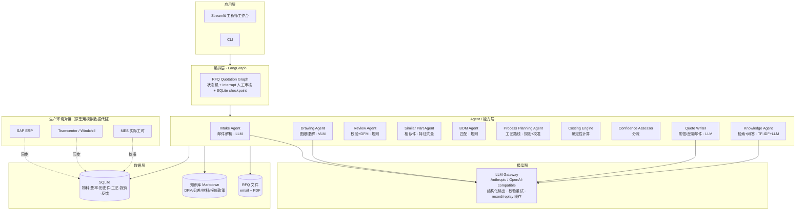
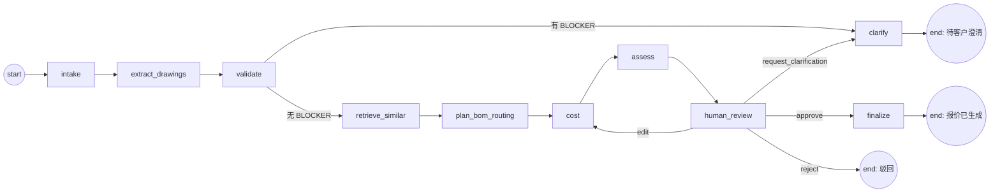

# RFQ & Quotation Agent 原型 — 设计文档

> 项目：IndustrialMind.ai Solution Design Challenge · Option B（Vibe Coding Prototype）
> 客户场景：PrecisionMotion GmbH（齿轮箱 / 伺服电机 / 执行器 / 定制机械组件，德国·波兰·中国三地工厂）
> 文档版本：v1.0 · 2026-09-25
> 配套文档：[`DEV_PLAN.md`](DEV_PLAN.md)（开发计划与进度）。最终对外提交的 `README.md` 用英文撰写，内容从本文提炼。

---

## 0. 一句话

**客户发来一封询价邮件和图纸 → 系统在几分钟内给出一份"带出处、带置信度、工程师一键确认"的报价草稿。**
AI 只负责"读懂"和"解释"，价格与工时由确定性引擎计算；工程师的每一次修改都会被记录下来，作为评测与改进的数据。

---

## 1. 目标与范围

### 1.1 为什么选 RFQ & Quotation

| 依据 | 数据 |
|---|---|
| 量最大 | 15,000 RFQ/年 |
| 工时占比最高 | 按每单 4 h 工程工时 ≈ 60,000 h/年 ≈ 36 FTE ≈ 150 名工程师总产能的 24% |
| 直接影响收入 | 报价周期决定赢单率 |
| 能力可复用 | 图纸理解、相似件检索、BOM、工艺路线都是报价的前置步骤，做完报价，BOM Agent / Process Planning Agent / Drawing Assistant 的核心能力也就同时具备了 |

因此原型以**报价链路为主线**，把 Drawing Understanding、Design Review（DFM）、BOM、Process Planning、Knowledge Search 作为链路中的环节一并展示。

### 1.2 In Scope（原型要做到）

1. 解析 RFQ 邮件（德语/英语）→ 结构化询价单
2. 读取 PDF 工程图纸（VLM）→ 结构化图纸规格（标题栏、材料、特征、公差、表面、热处理、明细表）
3. 规则化校验与 DFM 评审，问题附知识库出处；缺关键信息时自动起草澄清邮件（客户语言）
4. 相似历史件检索（可解释的特征相似度）
5. BOM 草稿（装配件：明细表逐项匹配标准件目录 / 内部件号 / 标记新件）
6. 工艺路线草稿（规则引擎 + 相似件工时校准）
7. 确定性成本计算：三地工厂对比、数量阶梯价、每个数字可追溯
8. 置信度评估 → 分流（快速确认 / 标准审核 / 人工处理）
9. Human-in-the-loop：工程师在工作台审核、修改工时、批准；修改自动重算并记录为反馈
10. 输出报价单（HTML/JSON）+ 客户附信
11. 工程知识问答（带出处）
12. 评测：图纸抽取准确率 + 成本引擎留一法回测
13. 运行界面：Streamlit 工作台 + CLI

### 1.3 Out of Scope（原型不做，README 中说明生产方案）

- 真实 ERP/PLM/MES 对接（用 SQLite + CSV 模拟，接口层按生产形态抽象）
- 3D CAD（STEP）几何解析（说明生产方案：pythonOCC/CAD 内核提取特征）
- 用户体系、权限、多租户
- 真实客户数据：所有数据为**合成数据**，明确标注

### 1.4 成功标准（原型验收）

| 指标 | 目标 |
|---|---|
| 5 份样例图纸标题栏字段准确率 | ≥ 90% |
| 特征识别召回率（类型+公称尺寸匹配） | ≥ 80% |
| 成本引擎留一法回测（历史件） | 中位绝对百分比误差 ≤ 15%，±20% 以内占比 ≥ 75% |
| 单个 RFQ 端到端耗时（live 模式） | ≤ 90 s |
| 离线 replay 模式 | 无 API key 可完整跑通 4 个样例 |
| 4 个样例的分流结果 | 与设计预期一致（见 §2） |

> 回测数据是合成的（按隐含工艺模型 + 噪声生成），回测结果证明的是"链路和校准机制正确"，不代表真实场景精度——README 中如实说明。

---

## 2. 演示样例（4 个 RFQ + 1 份评测图纸）

所有客户、零件均为虚构。

| RFQ | 语言 | 零件 | 设计要展示的能力 | 预期分流 |
|---|---|---|---|---|
| RFQ-2026-0101 | 德语 | 输出轴 Output Shaft Ø40×220，42CrMo4 调质，轴承位 Ø35 k6 Ra0.8，键槽，M12 中心孔；数量 200 / 500 | 德语邮件解析；精密公差→自动加磨削；中国工厂无磨床→被排除；**HITL：工程师修改磨削工时后重算** | STANDARD |
| RFQ-2026-0102 | 英语 | 伺服电机法兰 Motor Flange Ø120×25，EN AW-6082 T6，止口 Ø80 H7，4×M6 PCD100，4×Ø9 通孔，阳极氧化；数量 1,000 | 相似件高度吻合 → 快速确认；三地比价，数量阶梯 | FAST_TRACK |
| RFQ-2026-0103 | 英语 | 安装支架 Mounting Bracket 160×80×60，**标题栏材料为空**，1.5 mm 薄壁，深孔 Ø6×80 | 校验发现 BLOCKER → 不出价，自动起草英文澄清邮件；DFM 警告附知识库出处 | MANUAL（待客户澄清） |
| RFQ-2026-0104 | 德语 | 执行器子装配 Actuator Sub-Assembly，含明细表 7 行：内部壳体（已有件号）、内部轴（已有件号）、2×6204-2RS 轴承、油封 20×35×7、4×ISO 4762 M5×16、**端盖（新件号，库中没有）**；数量 50 | BOM Agent：逐行匹配标准件目录/内部件/新件；新件标红需补图 | STANDARD（带未定价项） |
| （评测用）DRW-0105 | — | 直齿轮 Spur Gear m2 z40 b20，16MnCr5 渗碳淬火 58–62 HRC | 只用于抽取评测（齿轮参数、热处理识别） | — |

---

## 3. 总体架构

### 3.1 分层架构



### 3.2 核心设计原则（架构决策，README 中重点阐述）

| # | 决策 | 理由 |
|---|---|---|
| D1 | **LLM 不算数**：价格、工时、重量全部由确定性代码计算 | LLM 算术不可靠、不可审计；报价是商业承诺，必须可复现 |
| D2 | **LLM 只用在非结构化 → 结构化的边界**：邮件解析、图纸读取、文字生成、知识问答 | 这几处是传统方法做不好、LLM 真正有价值的地方 |
| D3 | **结构化输出 + Pydantic 校验 + 带错误反馈的重试** | 保证下游拿到的永远是合法的数据结构；失败时留下原始输出作证据 |
| D4 | **每个数字都有出处**（source / formula / rule_id / ref_part_id） | 工程师信任的前提；审计要求 |
| D5 | **可解释的相似度**（加权特征），不用黑盒 embedding | 没有训练数据也能工作；工程师能看懂"为什么像"；生产中可叠加 3D 形状 embedding |
| D6 | **按置信度分流**，而不是全自动或全人工 | 高置信单一键确认省时间，低置信单强制人工保质量 |
| D7 | **人工修改即反馈数据**（before/after diff 入库） | 形成评测集，并用于校准工时系数，系统越用越准 |
| D8 | **LangGraph 状态机 + interrupt + checkpoint** | 流程确定、可观测；审核可以挂起几小时后恢复；比自由对话式多 agent 更适合工程流程 |
| D9 | **LLM 供应商可替换 + record/replay 缓存** | 避免锁定单一供应商（欧盟数据驻留可换私有部署模型）；评审者无 key 也能跑 demo；测试可复现 |
| D10 | **SQLite + CSV 模拟 ERP/PLM**，仓储层用 Repository 接口隔离 | 原型零运维；生产替换为 SAP/PLM 连接器时上层不动 |

---

## 4. 工作流设计（LangGraph）

### 4.1 状态图



说明：
- 一个 RFQ 可能有多个行项目（line），原型中各节点内部按行循环处理；生产中改为 LangGraph `Send` 做 map-reduce 并行。
- `validate` 只要有任一行存在 BLOCKER 就走 `clarify`（原型简化；生产可按行拆分：能报的先报）。
- `human_review` 用 `interrupt()` 挂起，把报价草稿作为 payload 交给 UI；UI 用 `Command(resume=ReviewDecision)` 恢复。
- `edit` 回到 `cost`：工程师改的是工艺路线（工时/增删工序）或价格参数，改完重算、重新评估、再次审核。
- checkpoint 存 SQLite（`data/runtime/checkpoints.db`），thread_id = rfq_id，可跨进程恢复。

### 4.2 节点清单

| 节点 | 输入 | 输出 | 实现方式 | 失败处理 |
|---|---|---|---|---|
| `intake` | `rfq_dir`（email.txt + drawings/*.pdf） | `RFQRequest` | LLM 结构化抽取 | 校验失败带错误重试 2 次；仍失败 → status=ERROR，保留原始输出 |
| `extract_drawings` | 每行的 PDF | `DrawingSpec` + 渲染图路径 | PDF→PNG（PyMuPDF，200 dpi）→ VLM 结构化抽取 → 后处理（单位归一、IT 等级计算、材料别名归一） | 同上；图纸找不到 → 该行 BLOCKER |
| `validate` | `DrawingSpec`, `RFQRequest` | `list[ValidationIssue]` | 规则引擎（§5.3），每条规则挂知识库出处 | — |
| `clarify` | issues | `clarification_email`（客户语言） | LLM 生成文字，问题清单由规则给出（LLM 不增删问题） | LLM 失败 → 模板兜底 |
| `retrieve_similar` | `DrawingSpec` | `list[SimilarPart]`（Top-3） | 特征向量加权相似度（§5.5） | 无相似件 → 置信度降低，不阻断 |
| `plan_bom_routing` | spec + similar | `list[BOMLine]`, `list[RoutingOp]` | 规则引擎 + 相似件校准（§5.6/§5.7） | 未覆盖特征 → 记录 `uncovered_features` |
| `cost` | routing, bom, qty, 主数据 | `list[CostBreakdown]`（工厂 × 数量） | 确定性公式（§5.8） | 工厂缺工位 → 该工厂标记 infeasible |
| `assess` | 以上全部 | `ConfidenceReport` | 公式（§5.9） | — |
| `human_review` | `QuoteDraft` | `ReviewDecision` | `interrupt()`；CLI `--auto-approve` 仅对 FAST_TRACK 生效 | — |
| `finalize` | 已批准的草稿 | `Quote`（HTML+JSON 落库）+ 附信 | 模板渲染 + LLM 写附信 | 附信失败 → 模板兜底 |

### 4.3 可观测性

每个节点执行写一条 `TraceEvent`（节点名、开始/结束时间、耗时、LLM 调用次数、token、是否命中缓存、摘要），存入 state.trace，同时写 `llm_calls` 表。UI 以时间线展示"系统做了什么、花了多久"。

---

## 5. 模块详细设计

### 5.1 Intake Agent（询价邮件解析）

- **输入**：`email.txt`（含发件人、主题、正文），附件文件名列表。
- **输出**：`RFQRequest`（§6.1）。
- **Prompt 要点**（`prompts/intake.v1.md`）：
  - 角色：制造企业销售内勤，从邮件中抽取询价信息
  - 规则：只抽取邮件里明确写出的信息，没有就填 null，不要推测；数量有多档时全部列出；日期统一为 ISO 格式；`language` 填邮件正文语言（de/en/pl/zh）；每行询价项必须对应一个附件图纸文件名
  - 特殊要求（材质证书 EN 10204 3.1、首件检验 FAI、PPAP、包装）放入 `special_requirements`
- **后处理**：`drawing_ref` 与实际附件做模糊匹配（大小写/扩展名）；匹配不上 → 该行 BLOCKER `VAL-010`。

### 5.2 Drawing Agent（图纸理解）

**流程**：
1. PyMuPDF 把 PDF 每页渲染成 PNG（200 dpi，A3 横版约 3300×2300 px），存 `data/runtime/renders/`。
2. 调用 VLM：图片 + 抽取 prompt + `DrawingSpec` JSON Schema（通过 tool use 实现结构化输出）。
3. 要求每个关键字段附 `evidence`（在图上看到的原文，如 `"Ø35 k6"`、`"42CrMo4+QT"`），**没有证据的字段视为低置信**。
4. 后处理（纯代码）：
   - 单位归一：inch → mm
   - 材料归一：别名表映射到主数据代码（`42CrMo4` / `1.7225` / `42CrMo4+QT` → `42CrMo4`）；映射不上 → `material_code=None` 并记 warning
   - 公差：由上下偏差或配合代号（`k6`、`H7`）计算 **IT 等级**（内置简化的 ISO 286 表：公称尺寸分段 × IT5–IT11）
   - 外形包络：rotational 取 max OD 和总长；prismatic 取长宽高
   - 一致性检查：各特征尺寸不应超过包络；特征数量与明细表合理

**Prompt 要点**（`prompts/drawing_extract.v1.md`）：
- 角色：有 20 年经验的机械加工工艺工程师，读 ISO/DIN 标准图纸
- 先读标题栏（右下角），再读各视图的尺寸标注、公差、表面粗糙度符号（Ra）、几何公差框、技术要求（Notes）、明细表
- 特征类型必须从枚举中选；螺纹写规范写法（M12×1.75）；配合代号保留原样
- 通用公差（如 `ISO 2768-mK`）单独填写，不要套用到每个尺寸上
- 看不清的就标 null 并写入 `extraction_warnings`，**严禁编造**

### 5.3 Review Agent（校验 + DFM 评审）

纯规则引擎，每条规则输出 `ValidationIssue`，并关联知识库章节（`kb_ref`）。LLM 不参与判断（保证确定性、可测试）。

| 规则 ID | 级别 | 条件 | 建议 | kb_ref |
|---|---|---|---|---|
| VAL-001 | BLOCKER | 材料为空 | 向客户确认材料牌号及标准 | `material_standards.md#material-callout` |
| VAL-002 | WARNING | 材料无法映射到主数据 | 确认等效牌号或采购可行性 | `material_standards.md#equivalents` |
| VAL-003 | BLOCKER | 数量为空 | 确认数量 | `quoting_policy.md#rfq-completeness` |
| VAL-004 | WARNING | 未注明通用公差 | 按 ISO 2768-m 报价并在假设中写明 | `tolerance_guide.md#general-tolerances` |
| VAL-005 | INFO | 有特征缺少公差且无通用公差 | 同上 | 同上 |
| VAL-010 | BLOCKER | 询价行找不到对应图纸 | 请客户补图 | `quoting_policy.md#rfq-completeness` |
| VAL-011 | WARNING | 装配明细表中有新件号且无图纸 | 该项在报价中列为"待报价（price on request）"，同时请客户补零件图；不阻断其余部分报价 | `quoting_policy.md#assemblies` |
| DFM-001 | WARNING | 壁厚 < 2 mm（钢）/ < 1.5 mm（铝） | 加厚或确认功能要求，注意变形与振刀 | `dfm_guidelines.md#thin-walls` |
| DFM-002 | WARNING | 孔深/孔径 > 10 | 需枪钻或分段钻，成本上升；建议减小深度或加大孔径 | `dfm_guidelines.md#deep-holes` |
| DFM-003 | INFO | 公差 ≤ IT6 | 需要磨削，确认是否功能必需 | `tolerance_guide.md#it-grades` |
| DFM-004 | WARNING | Ra ≤ 0.4 µm | 需要精磨/研磨，成本高 | `dfm_guidelines.md#surface-finish` |
| DFM-005 | INFO | 有热处理且有精密公差 | 热处理后需磨削，工艺顺序：粗加工→热处理→磨削 | `dfm_guidelines.md#heat-treatment-sequence` |
| DFM-006 | WARNING | 内角无圆角/圆角 < 0.5 mm（铣削型腔） | 建议圆角 ≥ 刀具半径 | `dfm_guidelines.md#internal-corners` |
| DFM-007 | INFO | 螺纹深度 > 3×D | 攻丝困难，建议 ≤ 2×D | `dfm_guidelines.md#threads` |

### 5.4 Knowledge Agent（工程知识库）

- **语料**：`data/knowledge/*.md`，5 篇合成文档：
  - `dfm_guidelines.md`：可制造性设计规则
  - `tolerance_guide.md`：ISO 286 IT 等级、ISO 2768、各加工方式能达到的精度
  - `material_standards.md`：材料牌号、EN/DIN 对照、等效牌号、热处理
  - `quoting_policy.md`：报价政策（毛利、最小订单金额、有效期、数量阶梯、装配件规则）
  - `plant_capabilities.md`：三地工厂设备能力、交期、优势品类
- **切块**：按二级/三级标题切 chunk，chunk id = `文件名#标题slug`（与规则 kb_ref 一致）。
- **检索**：scikit-learn TF-IDF（词 + 字符 3-gram，兼顾德语复合词）+ 余弦相似度，Top-4。
- **两种用法**：
  1. 规则直接引用：`kb_ref` 精确跳转到 chunk，UI 中点开可见原文（确定性）
  2. 自由问答：问题 → 检索 → LLM 仅基于检索片段作答，要求每句带 `[chunk_id]` 引用；检索分数低于阈值时直接回答"知识库中没有相关内容"（防止幻觉）
- **生产方案**：换成混合检索（BM25 + 向量 embedding + reranker），接入 PLM 文档、历史 ECR、8D 报告。

### 5.5 Similar Part Agent（相似件检索）

**特征向量**（从 `DrawingSpec` 和历史件表各自计算，同一个函数 `featurize()`）：

| 分量 | 计算 | 相似度函数 | 权重 |
|---|---|---|---|
| 形状类别 shape_class | rotational / prismatic / assembly | 不同类别：总分 × 0.3（软过滤） | — |
| 主尺寸 D | rotational 取 max OD；prismatic 取 max(宽, 高) | `exp(-|ln a − ln b| / 0.35)` | 0.20 |
| 长度 L | 总长 | 同上 | 0.15 |
| 材料 | 材料代码与材料组（steel / case_hardening_steel / aluminium / stainless / cast_iron） | 同代码 1.0；同组 0.7；否则 0.3 | 0.15 |
| 孔数 | 通孔 + 盲孔 | `1 − |a−b| / max(a, b, 1)` | 0.10 |
| 螺纹数 | — | 同上 | 0.10 |
| 特征标志 | keyway, gear, heat_treatment, surface_treatment（4 个布尔值） | 相同个数 / 4 | 0.15 |
| 精度 | 最小 IT 等级 | `exp(−|Δ| / 2)` | 0.15 |

- `score = Σ wᵢ·sᵢ`（× 形状惩罚），范围 0–1；返回 Top-3 且 score ≥ 0.50。
- 输出包含 `score_breakdown`，UI 画成条形图，让工程师看到"尺寸像、材料一样、精度不同"。
- **生产方案**：叠加 3D 形状描述子（STEP → 点云/B-Rep 图 → embedding）与图纸图像 embedding；向量库用 pgvector；多阶段召回（粗召回 → 加权精排）。

### 5.6 BOM Agent

- **单件（rotational/prismatic）**：BOM = 原材料 1 行（棒料/板料规格，自动选材料规格）+ 外协工序（热处理/表面处理，列为 service 行）。
  - 棒料：直径 = 最大外径 + 3 mm，向上取整到标准棒料系列（20, 25, 30, 35, 40, 45, 50, 55, 60, 70, 80, 90, 100, 110, 120, 130, 140, 150, 160, 180, 200）；长度 = 总长 + 5 mm（端面余量 + 锯缝）
  - 板/块料：长宽高各 + 3 mm，厚度向上取整到标准板厚系列
- **装配件**：逐行处理明细表：
  1. `part_number` 或 `description + standard` 匹配标准件目录（`standard_parts`，精确匹配件号 → 规范化描述匹配：如 "6204-2RS"、"ISO 4762 M5x16"）→ BUY，带单价
  2. 匹配内部零件主数据（`parts.part_number`）→ MAKE，带历史成本（取与本次批量最接近的 `part_costs`）
  3. 都匹配不上 → `source=NEW`，unit_cost 为空，产生 VAL-011，置信度降低
- 输出 `BOMLine`，每行带 `source`、`matched_ref`、`match_method`（exact / normalized / none）。

### 5.7 Process Planning Agent（工艺路线）

**两步：规则生成 → 相似件校准。**

**第 1 步：规则引擎生成工序**（`routing_rules.py`，每条规则带 ID）：

| 规则 | 触发条件 | 工序 / 工位 | 准备时间 setup (min) | 单件时间 cycle (min) |
|---|---|---|---|---|
| R01 | 自制件 | SAW 下料 | 5 | 0.5 + 0.02 × D_stock |
| R02 | rotational | CNC_TURN 车削 | 30 +（两端加工 +10） | 1.0 + 0.015 × V_removed / m + 0.3 × n_OD + 0.4 × n_groove + 0.1 × n_chamfer |
| R03 | prismatic | CNC_MILL_3AX 铣削；若需 > 3 个方向加工或注明 5 轴 → CNC_MILL_5AX | 45 | 2.0 + 0.02 × V_removed / m + 0.5 × n_pocket + 0.3 × n_slot |
| R04 | 有孔/螺纹 | rotational：DRILL 工位；prismatic：并入铣削工序 | 15（独立工序时） | 0.3 × n_hole × (1 + depth/D/5) + 0.4 × n_thread |
| R05 | 有键槽 | CNC_MILL_3AX 铣键槽 | 20 | 1.5 × n_keyway |
| R06 | 有齿形 | HOB 滚齿 | 40 | 0.12 × z × b / 10 × √module |
| R07 | 调质 QT 或渗碳淬火 | HEAT_TREAT 外协 | — | 按重量计价（§5.8） |
| R08 | 任一特征 ≤ IT6 或 Ra ≤ 0.8 | GRIND_CYL（rotational）/ GRIND_SURF（prismatic） | 25 | 1.5 × n_ground + 0.02 × L_ground |
| R09 | 铝件阳极氧化 / 钢件发黑、镀锌 | SURFACE 外协 | — | 按重量计价 |
| R10 | 所有自制件 | DEBURR 去毛刺 | 0 | 0.5 + 0.05 × n_features |
| R11 | ≥ 3 个特征 ≤ IT7 | INSPECT_CMM 三坐标；否则 INSPECT 手工检验 | 15 / 0 | 4.0 / 1.5 |
| R12 | 装配件 | ASSEMBLY 装配 | 20 | 1.2 × Σ 零件数 + 0.3 × 紧固件数 |
| R13 | 装配件 | TEST 功能测试 | 10 | 5.0 |
| R14 | 所有 | WASH_PACK 清洗包装 | 0 | 0.3 |

- `V_removed`（cm³）= 毛坯体积 − 成品体积估算。rotational 成品体积 = Σ 各外径段 π/4·d²·l − Σ 内孔 π/4·d²·l；抽取不到分段时用包络体积 × 0.7。
- `m` = 材料切削性系数（主数据）。
- **工序顺序**固定模板：SAW → TURN/MILL → DRILL → KEYWAY → HOB → HEAT_TREAT → GRIND → SURFACE → DEBURR → INSPECT → (ASSEMBLY → TEST) → WASH_PACK。
- 未被任何规则覆盖的特征计入 `uncovered_features`，影响置信度。

**第 2 步：相似件校准**：
- 对规则生成的每道工序，如果 Top-1 相似件（score ≥ 0.6）的历史工艺中有同一工位，则：
  - `scaled_ref = ref_cycle × (V_env_new / V_env_ref)^(2/3)`（按表面积比例缩放）
  - `w = score²`；`cycle = w × scaled_ref + (1 − w) × rule_cycle`
  - `basis = "blend"`，记录 `ref_part_id` 和 `w`
- 历史件中有、规则没生成的工序：列为"建议工序"（`suggested=True`），默认不计入成本，由工程师决定是否采纳——**这里只是提示，不自动加入**。

### 5.8 Costing Engine（成本计算，确定性）

对每个 **(工厂 × 数量档)** 计算一份 `CostBreakdown`：

```
材料费    = 毛坯重量(kg) × 材料单价(€/kg) × (1 + 废料率 3%)
            毛坯重量 = 毛坯体积(cm³) × 密度(g/cm³) / 1000
加工费    = Σ_工序 [ (setup_min / 批量 + cycle_min) / 60 × 费率(工厂, 工位) ]
外协费    = Σ_外协工序 max(单价(€/kg) × 成品重量, 每批最低收费 / 批量)
外购件    = Σ_BOM BUY 行 单价 × 用量
内部件    = Σ_BOM MAKE 行 历史单位成本 × 用量         （装配件）
小计      = 材料 + 加工 + 外协 + 外购 + 内部件
管理费    = 小计 × overhead_pct(工厂)                  （默认 12%）
物流关税  = 小计 × logistics_pct(工厂 → 德国客户)       （DE 1% / PL 3% / CN 8%）
成本价    = 小计 + 管理费 + 物流
单价      = 成本价 / (1 − 目标毛利率)                   （默认 18%，报价政策）
总价      = 单价 × 批量；低于最小订单金额 €500 时按 €500 计并注明
```

- **工厂可行性**：工艺路线中任一工位在该工厂不存在（例如 CN 没有 GRIND_CYL）→ `feasible=False` 并写明原因。
- **交期**：工厂基础交期（DE 3 周 / PL 4 周 / CN 9 周，含海运）+ 有外协工序时 +1 周；如早于客户要求交期 → 标记 `meets_due_date`。
- **推荐工厂**：在 feasible 且满足交期的工厂中选单价最低的；并列时优先 DE（沟通成本低）。
- **可追溯**：每个 `CostLine` 带 `formula`（代入数值后的算式字符串）和 `source`（如 `rates:PL/CNC_TURN`、`materials:42CrMo4`、`rule:R08`）。
- **价格合理性检查**：推荐单价与 Top-1 相似件同工厂、相近批量的历史报价（按体积^(2/3) 缩放）比较，偏差绝对值 > 30% → 标记，进入置信度计算。

### 5.9 Confidence Assessor（置信度与分流）

```
extraction   = 必填字段完整率 × 有证据字段占比 × (1 − 0.1 × 一致性检查失败数)，截断到 [0, 1]
               必填 = part_number, material, envelope, 至少 1 个特征, quantity
similarity   = Top-1 相似件分数（无相似件 = 0.3）
coverage     = 1 − uncovered_features / total_features
price_sanity = 1.0（偏差 ≤ 15%）/ 0.7（≤ 30%）/ 0.4（> 30%）/ 0.6（无参照）
装配件：bom_match = 已定价 BOM 行 / 总行数，参与加权

overall = 0.35 × extraction + 0.25 × similarity + 0.20 × coverage + 0.20 × price_sanity
          （装配件：0.30 / 0.20 / 0.15 / 0.15 + 0.20 × bom_match）
有 BLOCKER → overall = 0
```

| 分流档位 | 条件 | 工程师动作 |
|---|---|---|
| FAST_TRACK | overall ≥ 0.80 且无 WARNING | 快速浏览，一键批准 |
| STANDARD | 0.55 ≤ overall < 0.80，或有 WARNING | 必须查看高亮项（低置信字段、校准权重低的工序、价格偏差）后批准 |
| MANUAL | overall < 0.55 或有 BLOCKER | 人工处理 / 等客户澄清 |

`reasons` 列出每一个拉低分数的具体原因（例如 "material 无图纸证据"、"工序 GRIND_CYL 仅基于规则，无历史参照"）。

> 权重与阈值是经验初值。生产中用反馈数据标定：统计各档位中工程师的实际改动率，调阈值使 FAST_TRACK 档的改动率 < 5%。

### 5.10 Human-in-the-loop（审核与反馈）

- `human_review` 节点调用 `interrupt(QuoteDraft)` 挂起。
- 工作台展示：左侧图纸渲染图；右侧依次为抽取结果（含证据与低置信高亮）、问题清单（可展开知识库原文）、相似件（分数拆解）、工艺路线（可编辑表格）、三地成本对比、置信度与原因。
- 工程师操作 → `ReviewDecision`：
  - `approve`：进入 `finalize`
  - `edit`：修改工序（工时、增删工序、采纳建议工序）、毛利率、指定工厂 → 回到 `cost` 重算 → 再审核
  - `reject` / `request_clarification`
- **反馈记录**：每次 edit 产生 `FeedbackRecord`（before/after JSON + 字段级 diff + 审核人 + 时间）。
- **反馈的用途**（原型实现第 1 条，第 2、3 条在 README 中说明）：
  1. 评测集：`eval/feedback_report.py` 统计各工位"规则/校准估计 vs 人工修正"的偏差
  2. 工时系数标定：按工位聚合修正比例，更新规则系数（生产中定期离线执行，灰度上线）
  3. 置信度阈值标定

### 5.11 Quote Writer（报价输出）

- `Quote` = 报价头（报价号 `Q-{rfq_id}-v{n}`、客户、有效期 30 天、币种 EUR、Incoterm）+ 行项目（零件号、描述、工厂、数量阶梯单价、交期）+ **报价假设清单**（如"按 ISO 2768-m 报价"、"不含 3.1 材质证书"）+ 审批信息。
- 渲染：Jinja2 → HTML（可打印）+ JSON 落库。
- 附信：LLM 用客户语言写 5–8 句（感谢、报价摘要、关键假设、下一步），**价格数字由模板注入，不让 LLM 写数字**。
- 澄清邮件：问题清单来自规则，LLM 只负责措辞和语言。

---

## 6. 数据结构设计

### 6.1 领域模型（Pydantic v2，`src/rfq_agent/models/`）

```python
# ---------- 枚举 ----------
class ShapeClass(StrEnum):   ROTATIONAL = "rotational"; PRISMATIC = "prismatic"; ASSEMBLY = "assembly"
class FeatureType(StrEnum):  OUTER_DIAMETER = "outer_diameter"; BORE = "bore"; HOLE = "hole"; THREAD = "thread"
                             KEYWAY = "keyway"; GROOVE = "groove"; CHAMFER = "chamfer"; POCKET = "pocket"
                             SLOT = "slot"; FACE = "face"; WALL = "wall"; GEAR_TEETH = "gear_teeth"; SPLINE = "spline"
class Severity(StrEnum):     BLOCKER = "blocker"; WARNING = "warning"; INFO = "info"
class MakeOrBuy(StrEnum):    MAKE = "make"; BUY = "buy"; SERVICE = "service"
class Tier(StrEnum):         FAST_TRACK = "fast_track"; STANDARD = "standard"; MANUAL = "manual"
class RFQStatus(StrEnum):    NEW, EXTRACTED, NEEDS_CLARIFICATION, IN_REVIEW, APPROVED, REJECTED, ERROR

# ---------- 询价单 ----------
class RFQItem(BaseModel):
    line_no: int
    customer_part_number: str | None
    description: str | None
    drawing_ref: str                      # 附件文件名
    quantities: list[int]                 # 多个数量档
    requested_delivery: date | None
    notes: str | None

class RFQRequest(BaseModel):
    rfq_id: str
    customer_name: str
    contact_name: str | None
    contact_email: str | None
    language: Literal["de", "en", "pl", "zh"]
    received_at: date | None
    incoterm: str | None                  # e.g. "DAP", "FCA"
    currency: str = "EUR"
    special_requirements: list[str] = []  # "EN 10204 3.1", "FAI", "PPAP"
    items: list[RFQItem]

# ---------- 图纸 ----------
class Evidence(BaseModel):
    text: str                             # 图纸上看到的原文
    location: str | None                  # "title block" / "view A" / "notes"

class Tolerance(BaseModel):
    upper: float | None                   # mm
    lower: float | None
    fit: str | None                       # "k6" / "H7"
    it_grade: int | None = None           # 后处理计算，不由 LLM 填

class Feature(BaseModel):
    id: str                               # "F1", "F2" ...
    type: FeatureType
    description: str
    nominal_mm: float | None              # 直径 / 宽度 / 螺纹公称
    length_mm: float | None               # 段长 / 孔深 / 键槽长
    quantity: int = 1
    tolerance: Tolerance | None
    ra_um: float | None
    thread_spec: str | None               # "M12x1.75"
    gear_module: float | None
    gear_teeth: int | None
    face_width_mm: float | None
    evidence: Evidence | None

class TitleBlock(BaseModel):
    part_number: str | None
    revision: str | None
    title: str | None
    material: str | None                  # 图纸原文
    material_code: str | None = None      # 后处理映射到主数据
    general_tolerance: str | None         # "ISO 2768-mK"
    default_ra_um: float | None
    scale: str | None
    units: Literal["mm", "inch"] = "mm"
    drawn_by: str | None
    date: str | None
    evidence: dict[str, Evidence] = {}    # 字段名 -> 证据

class Envelope(BaseModel):
    shape_class: ShapeClass
    max_diameter_mm: float | None
    length_mm: float | None
    width_mm: float | None
    height_mm: float | None

class PartsListItem(BaseModel):
    item_no: int
    part_number: str | None
    description: str
    quantity: int
    material: str | None
    standard: str | None                  # "DIN 625", "ISO 4762"

class DrawingSpec(BaseModel):
    drawing_file: str
    title_block: TitleBlock
    envelope: Envelope
    features: list[Feature]
    heat_treatment: str | None            # "QT 28-32 HRC" / "case hardened 58-62 HRC"
    surface_treatment: str | None         # "anodized black" / "zinc plated"
    notes: list[str] = []
    parts_list: list[PartsListItem] = []
    extraction_warnings: list[str] = []

# ---------- 评审 ----------
class ValidationIssue(BaseModel):
    code: str                             # "VAL-001" / "DFM-002"
    severity: Severity
    line_no: int
    field_path: str | None                # "title_block.material" / "features[F3]"
    message: str
    suggestion: str
    kb_ref: str | None                    # "dfm_guidelines.md#deep-holes"

# ---------- 相似件 ----------
class SimilarPart(BaseModel):
    part_id: int
    part_number: str
    title: str
    score: float
    score_breakdown: dict[str, float]     # {"diameter": 0.93, "material": 1.0, ...}
    material_code: str
    ref_unit_cost_eur: float | None
    ref_qty: int | None
    ref_plant: str | None

# ---------- BOM / 工艺 ----------
class BOMLine(BaseModel):
    item_no: int
    part_number: str | None
    description: str
    qty_per: float
    unit: str = "pc"                      # "pc" / "kg" / "m"
    make_or_buy: MakeOrBuy
    source: Literal["catalog", "internal", "raw_material", "service", "new"]
    matched_ref: str | None
    match_method: Literal["exact", "normalized", "rule", "none"]
    unit_cost_eur: float | None
    confidence: float
    note: str | None = None

class RoutingOp(BaseModel):
    seq: int                              # 10, 20, 30 ...
    op_code: str                          # "TURN" / "GRIND_CYL"
    work_center: str
    description: str
    setup_min: float
    cycle_min: float
    outsourced: bool = False
    outsourced_price_eur_kg: float | None = None
    outsourced_lot_min_eur: float | None = None
    basis: Literal["rule", "blend", "manual"]
    rule_ids: list[str]
    ref_part_id: int | None = None
    blend_weight: float | None = None
    rule_cycle_min: float | None = None   # 保留规则原值，便于对比
    suggested: bool = False               # 相似件建议、尚未采纳的工序
    confidence: float

# ---------- 成本 ----------
class CostLine(BaseModel):
    category: Literal["material", "machining", "outsourced", "purchased",
                      "internal_parts", "overhead", "logistics", "margin"]
    description: str
    amount_eur_per_pc: float
    formula: str                          # "0.92 kg × 2.40 €/kg × 1.03"
    source: str                           # "materials:42CrMo4"

class CostBreakdown(BaseModel):
    plant: Literal["DE", "PL", "CN"]
    qty: int
    feasible: bool
    infeasible_reason: str | None
    lines: list[CostLine]
    unit_cost_eur: float                  # 成本价
    unit_price_eur: float                 # 报价单价
    total_price_eur: float
    lead_time_weeks: int
    meets_due_date: bool | None

# ---------- 置信度 ----------
class ConfidenceReport(BaseModel):
    extraction: float
    similarity: float
    coverage: float
    price_sanity: float
    bom_match: float | None
    overall: float
    tier: Tier
    reasons: list[str]

# ---------- 报价草稿 / 最终报价 ----------
class LineQuoteDraft(BaseModel):
    line_no: int
    item: RFQItem
    spec: DrawingSpec
    render_paths: list[str]
    issues: list[ValidationIssue]
    similar_parts: list[SimilarPart]
    bom: list[BOMLine]
    routing: list[RoutingOp]
    uncovered_features: list[str]
    costs: list[CostBreakdown]            # 工厂 × 数量档
    recommended_plant: str | None
    price_deviation_pct: float | None
    confidence: ConfidenceReport

class QuoteDraft(BaseModel):
    rfq_id: str
    version: int
    request: RFQRequest
    lines: list[LineQuoteDraft]
    assumptions: list[str]
    margin_pct: float

class ReviewEdit(BaseModel):
    line_no: int
    target: Literal["routing", "margin", "plant"]
    seq: int | None                       # routing 时指定工序
    field: str                            # "cycle_min" / "setup_min" / "add_op" / "remove_op" / "accept_suggested"
    new_value: Any

class ReviewDecision(BaseModel):
    action: Literal["approve", "edit", "reject", "request_clarification"]
    reviewer: str
    edits: list[ReviewEdit] = []
    comment: str | None = None

class Quote(BaseModel):
    quote_id: str                         # "Q-RFQ-2026-0101-v1"
    rfq_id: str
    customer_name: str
    valid_until: date
    currency: str
    lines: list[dict]                     # 行项目：件号、工厂、[qty, unit_price, total]、交期
    assumptions: list[str]
    cover_letter: str
    approved_by: str
    approved_at: datetime

class FeedbackRecord(BaseModel):
    rfq_id: str
    line_no: int
    reviewer: str
    edits: list[ReviewEdit]
    before: dict                          # routing/cost 快照
    after: dict
    created_at: datetime

class TraceEvent(BaseModel):
    node: str
    started_at: datetime
    duration_ms: int
    llm_calls: int
    cache_hits: int
    input_tokens: int
    output_tokens: int
    summary: str
```

### 6.2 Graph State（`graph/state.py`）

```python
class RFQState(TypedDict, total=False):
    rfq_id: str
    rfq_dir: str
    status: RFQStatus
    request: RFQRequest
    specs: dict[int, DrawingSpec]                 # line_no -> spec
    renders: dict[int, list[str]]
    issues: list[ValidationIssue]
    similar: dict[int, list[SimilarPart]]
    bom: dict[int, list[BOMLine]]
    routing: dict[int, list[RoutingOp]]
    uncovered: dict[int, list[str]]
    costs: dict[int, list[CostBreakdown]]
    confidence: dict[int, ConfidenceReport]
    draft: QuoteDraft
    margin_pct: float
    plant_override: dict[int, str]
    review: ReviewDecision | None
    review_round: int
    clarification_email: str | None
    quote: Quote | None
    trace: Annotated[list[TraceEvent], operator.add]   # reducer：追加
    error: str | None
```

### 6.3 数据库表（SQLite，`data/rfq.db`）

```sql
-- ===== 主数据（模拟 ERP）=====
CREATE TABLE materials (
  code TEXT PRIMARY KEY,           -- '42CrMo4'
  name TEXT, standard TEXT,        -- 'EN 10083-3'
  material_no TEXT,                -- '1.7225'
  mat_group TEXT,                  -- steel/case_hardening_steel/aluminium/stainless/cast_iron
  density_g_cm3 REAL, price_eur_kg REAL, machinability REAL,
  aliases TEXT                     -- JSON array
);
CREATE TABLE plants (
  code TEXT PRIMARY KEY,           -- DE/PL/CN
  name TEXT, country TEXT,
  overhead_pct REAL, logistics_pct REAL, base_lead_time_weeks INTEGER
);
CREATE TABLE work_centers (
  code TEXT, plant TEXT REFERENCES plants(code),
  name TEXT, rate_eur_h REAL,
  PRIMARY KEY (code, plant)
);
CREATE TABLE outsourced_services (
  code TEXT PRIMARY KEY,           -- HT_QT / HT_CASE / ANODIZE / ZINC
  name TEXT, price_eur_kg REAL, lot_min_eur REAL, extra_lead_weeks INTEGER
);
CREATE TABLE standard_parts (
  part_number TEXT PRIMARY KEY,    -- '6204-2RS'
  description TEXT, standard TEXT, normalized_key TEXT,
  unit_price_eur REAL, supplier TEXT, lead_time_days INTEGER
);

-- ===== 历史零件（模拟 PLM + ERP 后计算）=====
CREATE TABLE parts (
  part_id INTEGER PRIMARY KEY,
  part_number TEXT UNIQUE, title TEXT, family TEXT,   -- shaft/flange/bracket/housing/gear/assembly
  shape_class TEXT, material_code TEXT REFERENCES materials(code),
  max_diameter_mm REAL, length_mm REAL, width_mm REAL, height_mm REAL,
  finished_weight_kg REAL,
  n_holes INTEGER, n_threads INTEGER,
  has_keyway INTEGER, has_gear INTEGER,
  heat_treatment TEXT, surface_treatment TEXT,
  min_it_grade INTEGER, min_ra_um REAL,
  created_at TEXT
);
CREATE TABLE routings (
  part_id INTEGER REFERENCES parts(part_id),
  seq INTEGER, op_code TEXT, work_center TEXT,
  setup_min REAL, cycle_min REAL,                 -- 来自 MES 的实际工时
  PRIMARY KEY (part_id, seq)
);
CREATE TABLE part_costs (
  part_id INTEGER REFERENCES parts(part_id),
  plant TEXT, qty INTEGER, unit_cost_eur REAL,    -- ERP 后计算实际成本
  PRIMARY KEY (part_id, plant, qty)
);
CREATE TABLE assembly_bom (
  parent_part_id INTEGER REFERENCES parts(part_id),
  item_no INTEGER, child_part_number TEXT, qty REAL,
  PRIMARY KEY (parent_part_id, item_no)
);
CREATE TABLE quote_history (
  id INTEGER PRIMARY KEY,
  part_id INTEGER REFERENCES parts(part_id),
  customer TEXT, plant TEXT, qty INTEGER, unit_price_eur REAL,
  quoted_at TEXT, won INTEGER
);

-- ===== 运行数据 =====
CREATE TABLE quotes (
  quote_id TEXT PRIMARY KEY, rfq_id TEXT, version INTEGER,
  status TEXT, payload TEXT,                      -- Quote JSON
  approved_by TEXT, approved_at TEXT, created_at TEXT
);
CREATE TABLE feedback (
  id INTEGER PRIMARY KEY, rfq_id TEXT, line_no INTEGER,
  reviewer TEXT, edits TEXT, before TEXT, after TEXT, created_at TEXT
);
CREATE TABLE llm_calls (
  id INTEGER PRIMARY KEY, ts TEXT, rfq_id TEXT, node TEXT,
  provider TEXT, model TEXT, prompt_version TEXT,
  input_tokens INTEGER, output_tokens INTEGER, latency_ms INTEGER,
  cache_hit INTEGER, attempts INTEGER, ok INTEGER, error TEXT
);
```

仓储层（`data/repositories.py`）对上层暴露 `MaterialRepo`、`RateRepo`、`PartRepo`、`CatalogRepo`、`QuoteRepo`、`FeedbackRepo`，上层不写 SQL。生产替换为 SAP OData / PLM REST 适配器。

---

## 7. LLM 层设计

### 7.1 接口

```python
class LLMClient:
    def structured(self, *, task: str, prompt_version: str, system: str,
                   user_text: str, images: list[Path] = [],
                   schema: type[T], max_retries: int = 2) -> T: ...
    def text(self, *, task: str, prompt_version: str, system: str,
             user_text: str) -> str: ...
```

- **结构化输出**：Anthropic 走 tool use（`input_schema` = Pydantic 模型的 JSON Schema，`tool_choice` 强制调用该工具）；OpenAI-compatible 走 `response_format=json_schema` 或 tool call。
- **校验重试**：`schema.model_validate()` 失败 → 把原输出和校验错误作为新一轮 user 消息发回，要求修正，最多 2 次；最终失败抛 `ExtractionError`，附原始输出（存 `data/runtime/failures/`），而不是悄悄返回空值。
- **参数**：temperature 0；max_tokens 按任务配置（图纸抽取 8k）。
- **Prompt 管理**：`src/rfq_agent/llm/prompts/{task}.v{n}.md`，版本号写入 `llm_calls` 和缓存键。

### 7.2 Provider

| Provider | 用途 | 配置 |
|---|---|---|
| `anthropic`（默认） | 视觉 + 文本 | `ANTHROPIC_API_KEY`，`LLM_MODEL`（默认 `claude-sonnet-5`，实现时按 claude-api 参考确认） |
| `openai_compat` | 任意兼容 OpenAI 的端点（GPT、Gemini、私有部署 Qwen-VL 等） | `OPENAI_API_KEY`、`OPENAI_BASE_URL`、`LLM_MODEL` |

### 7.3 Record / Replay 缓存

- `LLM_MODE = live | record | replay | auto`（默认 `auto`：有 key 就 live 并写缓存，没有 key 就 replay）。
- 缓存键 = `sha256(provider, model, task, prompt_version, system, user_text, 各图片内容的 sha256, schema JSON)`。
- 缓存文件：`fixtures/llm_cache/{task}/{key[:16]}.json`，内容为 `{request_meta, raw_response, parsed, usage, recorded_at}`，入库提交。
- replay 模式缓存未命中 → 抛出明确错误（"该输入没有录制结果，请设置 API key 以 live 模式运行"）。
- **原则：replay 数据必须是真实模型的录制输出，不能手写**。README 注明录制所用模型和日期。

### 7.4 LLM 调用点汇总

| 任务 | 模型能力 | 输出 | 每 RFQ 调用次数 |
|---|---|---|---|
| `intake` | 文本 | `RFQRequest` | 1 |
| `drawing_extract` | 视觉 | `DrawingSpec` | 每张图纸 1 次 |
| `clarification_email` | 文本 | str | 0–1 |
| `cover_letter` | 文本 | str | 0–1 |
| `kb_answer` | 文本 | 带引用的回答 | 按需 |

---

## 8. 合成数据设计

### 8.1 主数据（`data/master/*.csv`，脚本 `scripts/gen_master_data.py` 写入 SQLite）

**材料**

| code | 名称 | 组 | 密度 | €/kg | 切削性 m |
|---|---|---|---|---|---|
| C45 | C45 (1.0503) | steel | 7.85 | 1.60 | 1.00 |
| 42CrMo4 | 42CrMo4 (1.7225) | steel | 7.85 | 2.40 | 0.80 |
| 16MnCr5 | 16MnCr5 (1.7131) | case_hardening_steel | 7.85 | 2.20 | 0.85 |
| AW6082 | EN AW-6082 T6 | aluminium | 2.70 | 4.80 | 2.50 |
| GJS500 | EN-GJS-500-7 | cast_iron | 7.10 | 2.00 | 1.10 |
| X5CrNi18-10 | 1.4301 | stainless | 7.90 | 4.50 | 0.50 |

**工位费率（€/h，DE / PL / CN，"—" 表示该厂没有该工位）**

| 工位 | DE | PL | CN |
|---|---|---|---|
| SAW | 45 | 28 | 18 |
| CNC_TURN | 95 | 58 | 36 |
| CNC_MILL_3AX | 105 | 62 | 40 |
| CNC_MILL_5AX | 145 | 85 | — |
| DRILL | 70 | 42 | 26 |
| GRIND_CYL | 120 | 70 | — |
| GRIND_SURF | 110 | 65 | 42 |
| HOB | 125 | — | 48 |
| DEBURR | 55 | 30 | 18 |
| INSPECT | 85 | 50 | 32 |
| INSPECT_CMM | 110 | 68 | 45 |
| ASSEMBLY | 70 | 40 | 24 |
| TEST | 80 | 45 | 28 |
| WASH_PACK | 45 | 26 | 16 |

**工厂**：DE（管理费 12%，物流 1%，交期 3 周）；PL（12%，3%，4 周）；CN（12%，8%，9 周）。

**外协**：HT_QT 调质 €2.0/kg（每批最低 €120）；HT_CASE 渗碳淬火 €3.5/kg（€150）；ANODIZE 阳极氧化 €12/kg（€80）；ZINC 镀锌 €1.8/kg（€60）；BLACK 发黑 €1.2/kg（€50）。

**标准件目录**：约 20 项：轴承 6204-2RS / 6205-2RS / 6206-2RS / 6004-2RS，油封 20×35×7 / 25×40×7，ISO 4762 M4/M5/M6/M8 各长度，DIN 6885 平键，挡圈 DIN 471/472，O 形圈。

### 8.2 历史零件（`scripts/gen_history.py`，固定随机种子）

- 约 90 个零件：shaft ×25、flange/cover ×20、bracket ×15、housing ×10、gear ×12、assembly ×8。
- 每个族有参数分布（尺寸范围、常用材料、特征数量范围、精度分布、热处理/表面处理概率）。
- **真实工时 = 规则工时 × 族隐含系数（0.85–1.25，模拟规则的系统性偏差）× 对数正态噪声（σ = 0.12）**。这样规则引擎单独估算会有系统偏差，相似件校准可以纠正一部分——回测能体现校准的价值。
- `part_costs`：用成本引擎在三地 × {50, 200, 500, 1000} 数量档上计算"实际成本"（使用真实工时）。
- `quote_history`：每件 1–3 条历史报价，单价 = 实际成本 / (1 − 毛利率 ~ U(0.12, 0.25))，赢单概率随价格偏高而下降。
- 与 4 个样例相近的历史件要保证存在（例如 Ø38 输出轴、Ø110 电机法兰），以确保演示效果可控；装配件样例引用的内部件号（壳体、轴）存在于 `parts` 表中。

### 8.3 样例图纸（`scripts/gen_drawings.py`）

- matplotlib 绘制 A3 横版 PDF：图框、右下角标题栏（DIN EN ISO 7200 风格：零件号、版本、名称、材料、通用公差、比例、日期、绘图人）、主视图 + 剖视图/侧视图、尺寸线与公差、粗糙度标注、技术要求区、装配图明细表。
- 目标是"像真的图纸、VLM 能读懂"，不追求符合制图标准的每一个细节。
- 每张图配一份 `expected.json`（人工编写的金标准 `DrawingSpec`），用于抽取评测。
- RFQ-0103 故意在材料栏留空；RFQ-0101 的邮件用德语。

目录：

```
data/samples/
  RFQ-2026-0101/ email.txt  drawings/SH-4711.pdf   expected/SH-4711.json
  RFQ-2026-0102/ email.txt  drawings/FL-2208.pdf   expected/FL-2208.json
  RFQ-2026-0103/ email.txt  drawings/BR-0930.pdf   expected/BR-0930.json
  RFQ-2026-0104/ email.txt  drawings/ASM-5100.pdf  expected/ASM-5100.json
  eval_only/                drawings/GR-3340.pdf   expected/GR-3340.json
```

---

## 9. 评测设计（`eval/`）

| 评测 | 方法 | 指标 | 输出 |
|---|---|---|---|
| 图纸抽取 `eval_extraction.py` | 5 张图纸抽取结果 vs `expected.json` | 标题栏字段准确率（字符串规范化后比较；数值误差 ≤ 1%）；特征 precision/recall（按类型 + 公称尺寸 ±0.5 mm 匹配）；公差/配合代号准确率；热处理/表面处理识别 | `eval/reports/extraction.md` |
| 成本回测 `backtest_costing.py` | 对每个历史件做留一法：从库中去掉该件，用其结构化特征（跳过 VLM）走相似件 → 工艺 → 成本，与 `part_costs` 实际值比较 | MdAPE、±10% / ±20% 命中率；对比"仅规则"和"规则 + 相似件校准"两种方式 | `eval/reports/backtest.md` + 误差分布图 |
| 分流检查 `eval_routing.py` | 4 个样例跑完整链路 | 分流档位与 §2 预期一致 | 终端输出 |
| 反馈统计 `feedback_report.py` | 读 `feedback` 表 | 各工位人工修正比例 | `eval/reports/feedback.md` |

---

## 10. 技术栈

| 类别 | 选型 | 理由 |
|---|---|---|
| 语言 / 环境 | Python 3.12 + uv | 生态完整；3.14 过新，部分依赖未适配 |
| 编排 | LangGraph（+ `langgraph-checkpoint-sqlite`） | 显式状态机、`interrupt` 做人工审核、checkpoint 可恢复 |
| 数据模型 | Pydantic v2 | 同一套模型用于 LLM schema、校验、序列化 |
| LLM SDK | `anthropic`、`openai` | 两类 provider |
| PDF | PyMuPDF | 渲染快、无系统依赖 |
| 图纸生成 / 图表 | matplotlib | 同一个库画图纸和评测图 |
| 检索 | scikit-learn TF-IDF、numpy | 轻量、无需 GPU 或外部服务 |
| 存储 | SQLite（标准库） | 零运维 |
| 模板 | Jinja2 | 报价单 HTML |
| UI | Streamlit | 快速做出可交互的工作台（`st.data_editor` 编辑工艺表） |
| CLI | Typer + Rich | 端到端演示、脚本化评测 |
| 测试 | pytest | 规则、成本、相似度的单元测试；graph 用 replay 做集成测试 |
| 代码质量 | ruff | lint + format |

---

## 11. 目录结构

```
industrialmind-rfq-agent/
├── README.md                       # 英文，对外提交
├── pyproject.toml / uv.lock / .env.example / Makefile
├── docs/
│   ├── DESIGN.md                   # 本文
│   ├── DEV_PLAN.md                 # 开发计划 + 进度
│   └── images/                     # 架构图、截图、GIF
├── src/rfq_agent/
│   ├── config.py                   # 路径、环境变量、业务参数（毛利、阈值）
│   ├── models/                     # §6.1 Pydantic 模型
│   ├── data/
│   │   ├── db.py                   # 建表、连接
│   │   └── repositories.py         # 仓储接口
│   ├── llm/
│   │   ├── client.py               # LLMClient：结构化输出、重试
│   │   ├── providers.py            # anthropic / openai_compat
│   │   ├── cache.py                # record/replay
│   │   └── prompts/*.md            # 带版本号的 prompt
│   ├── agents/
│   │   ├── intake.py
│   │   ├── drawing.py              # 渲染 + 抽取 + 后处理
│   │   ├── postprocess.py          # 单位、材料别名、IT 等级（ISO 286 表）
│   │   ├── review_rules.py         # VAL / DFM 规则
│   │   ├── knowledge.py            # 切块、TF-IDF、问答
│   │   ├── similarity.py           # featurize + 加权相似度
│   │   ├── bom.py
│   │   ├── routing_rules.py        # R01–R14 + 相似件校准
│   │   ├── costing.py
│   │   ├── confidence.py
│   │   └── quote_writer.py         # Jinja2 + 附信 / 澄清邮件
│   ├── graph/
│   │   ├── state.py
│   │   ├── nodes.py
│   │   └── build.py                # 组装 StateGraph + checkpointer
│   ├── templates/quote.html.j2
│   ├── cli.py
│   └── ui/app.py                   # Streamlit
├── scripts/
│   ├── gen_master_data.py
│   ├── gen_history.py
│   ├── gen_drawings.py
│   └── build_db.py                 # 一键重建 data/rfq.db
├── data/
│   ├── master/*.csv
│   ├── knowledge/*.md
│   ├── samples/…                   # §8.3
│   └── runtime/                    # 渲染图、checkpoint、失败样本（gitignore）
├── fixtures/llm_cache/             # 录制的 LLM 输出（入库）
├── eval/
│   ├── eval_extraction.py
│   ├── backtest_costing.py
│   ├── eval_routing.py
│   ├── feedback_report.py
│   └── reports/
└── tests/
```

---

## 12. 从原型到生产（README 中的"Production Path"一节）

| 方面 | 原型 | 生产 |
|---|---|---|
| 数据源 | SQLite + CSV | SAP S/4HANA（物料、费率、后计算成本）、Teamcenter/Windchill（图纸、版本、ECR）、MES（实际工时）；增量同步 + 变更事件 |
| 图纸 | PDF → VLM | + STEP/Parasolid 几何特征提取（CAD 内核）；图纸与 3D 模型交叉校验 |
| 相似件 | 加权特征 | + 3D 形状 embedding + pgvector，多阶段召回 |
| 模型部署 | 公有云 API | 欧盟区域托管或私有部署开源 VLM；GDPR、EU AI Act 合规；按客户隔离数据 |
| 标定 | 固定系数 | 基于 MES 实际工时与审核反馈定期重标定，影子模式对比后上线 |
| 审核 | 单人批准 | 按金额分级审批，接入 CRM/ERP 报价流程 |
| 监控 | trace 表 | 抽取准确率、改动率、FAST_TRACK 占比、报价周期、赢单率看板 |
| 多语言 | 德/英 | + 波兰语、中文；三地工程师各自用母语的工作台 |

---

## 13. 风险与已知局限（如实写入 README）

1. 所有数据是合成的；回测体现的是机制，不代表真实精度。
2. 生成的图纸比真实图纸干净；真实场景中扫描件、手写批注、多页图纸、非标准标题栏会显著降低抽取准确率 → 生产中需要按客户的图纸样式做评测集并持续跟踪。
3. 规则系数是经验值，需要用客户的 MES 数据标定。
4. 置信度权重与阈值是初值，需要用反馈数据标定。

---

## 14. 待确认事项

| # | 事项 | 影响 | 默认处理 |
|---|---|---|---|
| Q1 | 用哪个 LLM API key 录制 live 结果（Anthropic / OpenAI-compatible / 其他 VLM） | M3 起需要；决定 replay 缓存用哪个模型录制 | M0–M2 不依赖 LLM，可先行；到 M3 前确认 |
| Q2 | 最终是否要附带 2–3 页 slides 概括 Part 1/4/5 | 交付形式 | 先把 README 做完整，slides 作为可选的 M12 |

---

## 15. v1.1 修订（2026-09-26）

依据 v1.0 设计的整体评审（业务测算见 README §7）。本节与前文冲突时以本节为准；模块接口以 [`CONTRACTS.md`](CONTRACTS.md) 为准。

1. **历史件真实工时改由独立的"隐藏工艺模型"生成**（替代 §8.2 中"规则工时 × 系数 × 噪声"）。隐藏模型与 §5.7 规则引擎公式结构不同，包含规则看不到的因素：材料硬度的非线性影响、小批量换型损耗、零件族特有工序（如轴类去应力/校直、壳体类时效）、工厂/班组差异、对数正态噪声。历史件还需保存各自的结构化 `DrawingSpec`（`data/history/specs.jsonl`），供留一法回测直接使用。
2. **相似件复用提示**：score ≥ 0.92 且材料相同、主尺寸差 < 5% → INFO 级 `REUSE-001`，建议沿用参考件工艺与检验计划；知识库新增 `quoting_policy.md#part-reuse`。RFQ-0102 的锚点件要满足该条件。
3. **模型**：默认 provider 为本机 Ollama，默认模型 `gemma4:12b`（多模态，文本和图纸共用一个模型，内存占用约 8–10 GB，开发时并行跑 agent 不卡）；`qwen3.5:9b` 作为对比组，`gemma4:26b`（MoE）视内存情况作为最终录制候选；`openai_compat` / `anthropic` 作为可选。replay 缓存录制的是本地模型的真实输出。模型选型以阶段 2 的实测对比为准，结果写入评测报告。
6. **图纸分区域送图**：A3 图纸整图送入会被压缩，小字（公差、粗糙度）看不清。改为：整图（定位 + 整体理解）+ 固定区域裁剪（右下角标题栏、明细表、技术要求区）+ 各视图裁剪（先让模型在整图上给出视图位置，再裁出细读），合并为一份 `DrawingSpec`。Gemma 4 的视觉 token 预算设为最高档 1120。
4. **工程师助手（工具调用型 Agent）**：设计保留（00 文档 §4.2），今天不实现；知识库只做检索（规则引用 + 搜索），不做 LLM 问答。
5. **编排**：主流程 LangGraph；agentbloom-runtime-worker 不接入，README 的 Production Path 中说明其适用场景（开放式助手）。
