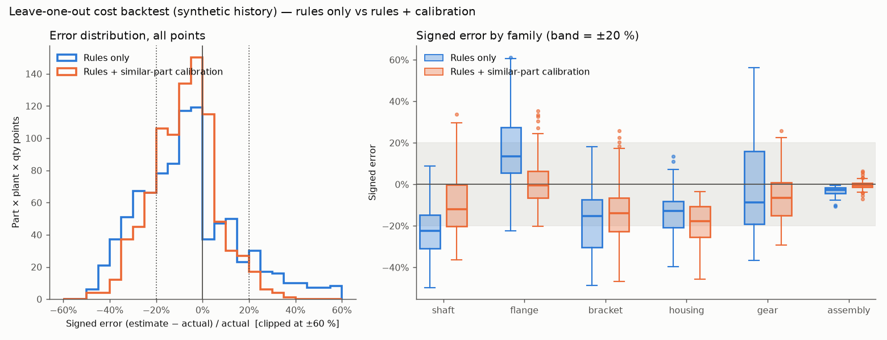

# Cost backtest — leave-one-out over the synthetic history

_Generated by `eval/backtest_costing.py` (`make eval`). All data is synthetic; see [How the data was generated](#how-the-data-was-generated) before reading any number._

## Headline

90 historical parts × their own (plant, qty) combinations = 908 points per method. Each part is removed from the similarity search before it is estimated; its drawing data is the stored `DrawingSpec` (perfect extraction — this isolates the cost engine from the VLM).

| Metric | Rules only | Rules + calibration | DESIGN §1.4 target | Calibrated vs target |
|---|---:|---:|---:|---|
| MdAPE | 15.0% | **10.3%** | ≤ 15 % | ✅ met |
| Share within ±20 % | 61.1% | **78.4%** | ≥ 75 % | ✅ met |
| Share within ±10 % | 35.2% | **49.2%** | – | |
| Median bias (signed) | -7.7% | **-7.1%** | – | |
| Points not estimable (plant infeasible for the planned routing) | 0 | 0 | – | |

Sensitivity — if the engineer accepts every suggested operation: MdAPE 7.7%, within ±20 % 85.4%, bias -1.7%.

Calibration was applied (top similar part score ≥ 0.6) for 90 of 90 parts. **REUSE-001 fired for 9 of 90 parts** under leave-one-out (SH-4185, SH-4206, HS-5208, HS-5229, GR-3415, GR-3422, GR-3436, GR-3443, GR-3450). Suggested (not costed) ops produced by calibration: INSPECT ×20, TOOTH_CHAMFER ×17, STRAIGHTEN ×10, MILL_FINISH ×7, SURFACE ×3, KEYWAY ×1.

## By family

| Slice | Method | Points | MdAPE | within ±10 % | within ±20 % | Median bias | Infeasible |
|---|---|---:|---:|---:|---:|---:|---:|
| shaft | Rules only | 208 | 22.5% | 14.9% | 42.3% | -22.5% | 0 |
|  | Rules + similar-part calibration | 208 | 15.4% | 31.2% | 69.2% | -11.9% | 0 |
|  | Calibrated + suggested ops accepted | 208 | 13.9% | 36.1% | 74.5% | -9.0% | 0 |
| flange | Rules only | 240 | 14.2% | 34.2% | 60.4% | +13.4% | 0 |
|  | Rules + similar-part calibration | 240 | 6.5% | 70.4% | 93.3% | -0.4% | 0 |
|  | Calibrated + suggested ops accepted | 240 | 6.6% | 69.6% | 91.2% | -0.4% | 0 |
| bracket | Rules only | 180 | 15.6% | 33.3% | 57.8% | -15.4% | 0 |
|  | Rules + similar-part calibration | 180 | 15.0% | 32.2% | 68.3% | -13.9% | 0 |
|  | Calibrated + suggested ops accepted | 180 | 9.9% | 50.0% | 81.7% | -2.3% | 0 |
| housing | Rules only | 120 | 13.1% | 35.0% | 72.5% | -12.9% | 0 |
|  | Rules + similar-part calibration | 120 | 17.7% | 22.5% | 58.3% | -17.7% | 0 |
|  | Calibrated + suggested ops accepted | 120 | 9.3% | 53.3% | 85.0% | +0.7% | 0 |
| gear | Rules only | 64 | 18.4% | 15.6% | 54.7% | -8.6% | 0 |
|  | Rules + similar-part calibration | 64 | 10.1% | 50.0% | 85.9% | -6.5% | 0 |
|  | Calibrated + suggested ops accepted | 64 | 9.8% | 53.1% | 87.5% | -5.1% | 0 |
| assembly | Rules only | 96 | 2.6% | 99.0% | 100.0% | -2.6% | 0 |
|  | Rules + similar-part calibration | 96 | 1.0% | 100.0% | 100.0% | -0.5% | 0 |
|  | Calibrated + suggested ops accepted | 96 | 1.0% | 100.0% | 100.0% | -0.5% | 0 |

Suggested ops by family: shaft: STRAIGHTEN ×10, TOOTH_CHAMFER ×5, SURFACE ×2, KEYWAY ×1; flange: SURFACE ×1; bracket: INSPECT ×10; housing: INSPECT ×10, MILL_FINISH ×7; gear: TOOTH_CHAMFER ×12.

## By plant

| Slice | Method | Points | MdAPE | within ±10 % | within ±20 % | Median bias | Infeasible |
|---|---|---:|---:|---:|---:|---:|---:|
| DE | Rules only | 360 | 17.5% | 30.0% | 56.1% | -7.6% | 0 |
|  | Rules + similar-part calibration | 360 | 11.0% | 46.7% | 76.7% | -5.9% | 0 |
|  | Calibrated + suggested ops accepted | 360 | 9.1% | 52.5% | 81.9% | -0.6% | 0 |
| PL | Rules only | 292 | 14.3% | 35.3% | 61.3% | -9.3% | 0 |
|  | Rules + similar-part calibration | 292 | 10.9% | 47.9% | 77.4% | -7.9% | 0 |
|  | Calibrated + suggested ops accepted | 292 | 8.2% | 57.5% | 85.3% | -1.8% | 0 |
| CN | Rules only | 256 | 12.6% | 42.6% | 68.0% | -7.6% | 0 |
|  | Rules + similar-part calibration | 256 | 8.7% | 54.3% | 82.0% | -7.3% | 0 |
|  | Calibrated + suggested ops accepted | 256 | 6.4% | 66.0% | 90.2% | -2.6% | 0 |

## How the data was generated

The history (90 parts: 25 shafts, 20 flanges/covers, 15 brackets, 10 housings, 12 gears, 8 assemblies) is produced by `scripts/gen_history.py` with a fixed seed. The "actual" times are **not** the rule engine plus noise — that would make the backtest grade its own homework. They come from an independent *hidden process model* (`hidden_routing`) with a different functional form and factors the rules cannot see:

- material effect from a hardness table the rules never see, `(HB/200)^1.7 ×` chip factor (QT steels finish-turned at ~290 HB, stainless ×1.8), where the rules divide removed volume linearly by master-data machinability;
- turning time driven by turned *surface* rather than removed volume; milling by clampings and pocket depths that are not on the drawing;
- family-specific practice as a multiplier (flange 0.50 … housing 1.20) plus per-part lognormal noise σ = 0.12 and per-op noise σ = 0.05, a fixed changeover per batch, a small-batch learning penalty (×1.35 at 50 pcs … ×1.08 at 1,000) and crew factors (DE 1.00 / PL 1.06 / CN 1.12);
- family-specific extra operations the rules never generate: STRAIGHTEN for long heat-treated shafts, a second MILL_FINISH setup after stress-relief ageing on cast housings, CMM inspection on every housing, TOOTH_CHAMFER on gears.

The actual unit costs in `part_costs` are then computed with the same costing engine (rates, overhead, logistics, material, outsourcing) on those hidden times, so the backtest measures the *routing/time* estimate; rates and material prices are, by construction, identical.

**Demo control.** A handful of anchor parts are placed by hand so the four demo RFQs behave as designed (e.g. FL-2150 near-identical to the demo flange, SH-4650 a moderately similar shaft). The generator also **re-draws any random variant that would out-rank an anchor against a demo drawing** (up to 30 attempts), so the demo's nearest neighbours are guaranteed. This shapes the neighbourhood of the four demo drawings only; it does not select parts by backtest error, but it is still a hand on the scale and is stated here plainly.

## Reading the results

- **Where calibration helps.** MdAPE rules → calibrated: shaft 22.5% → 15.4%, flange 14.2% → 6.5%, gear 18.4% → 10.1%, assembly 2.6% → 1.0%. Blending with the nearest part's MES times removes the error that is shared within a family — the hardness effect, surface-driven turning and family practice (e.g. flanges run at half the time the rules expect).
- **Where it does not.** No gain (MdAPE rules → calibrated): bracket 15.6% → 15.0%, housing 13.1% → 17.7%. The largest gap for housings and brackets is *operations the rules do not plan at all* (MILL_FINISH after stress-relief ageing, CMM instead of manual inspection). Calibration only blends times of ops that exist in both routings; ops that only the reference part has are surfaced as **suggestions** and are deliberately **not costed** until an engineer accepts them (a suggestion from a 0.6-similar part must not silently move a price). For housings calibration even makes it worse. Example HS-5101: the rules plan a SAW op (cast housings are not sawn) and manual inspection — both stay unblended because the reference has no matching op — while the reference's MILL time, which excludes its separate MILL_FINISH setup, pulls MILL down (10.2 → 8.2 min vs 10.3 min actual). The rules' accidental offset disappears and the bias moves further negative. The "suggested ops accepted" row shows the engineer closes most of the gap with one click per op — which is exactly why suggestions are listed in the review reasons.
- **Residual bias is negative** (estimates too low): non-planned ops, the small-batch learning penalty and crew factors (PL ×1.06, CN ×1.12) are invisible to the rules. In production this is what the feedback loop recalibrates (see `feedback.md`).
- **Per-part noise** (σ = 0.12 lognormal on every part, σ = 0.05 per op) is individual; no neighbour predicts it, so a floor of error remains for any method.
- **Assemblies look almost perfect for a trivial reason:** their cost is dominated by purchased and internal part costs that are read from the same tables in estimate and actual; only assembly / test time is estimated. Do not read the assembly row as evidence of accuracy.
- **REUSE-001** fires for parts whose product line contains a near-duplicate variant (same material, main dimensions within 5 %). Under leave-one-out the part itself is excluded, so these are genuine near-twins, not self-matches.

These numbers show that the chain (similarity → calibration → costing) works and that calibration adds value where the hidden process has learnable structure. They are **not** an accuracy claim for a real shop floor: in production the same script runs on ERP/MES history in shadow mode before any threshold is trusted.
